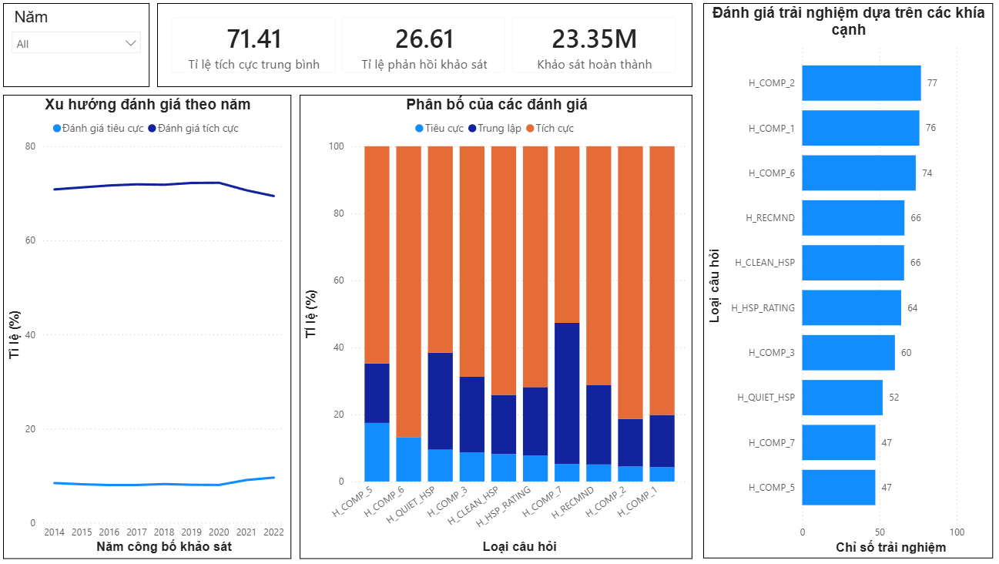
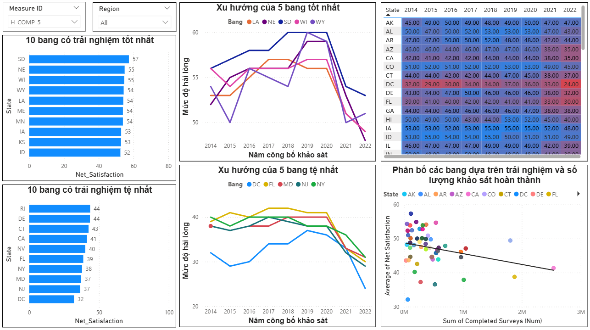
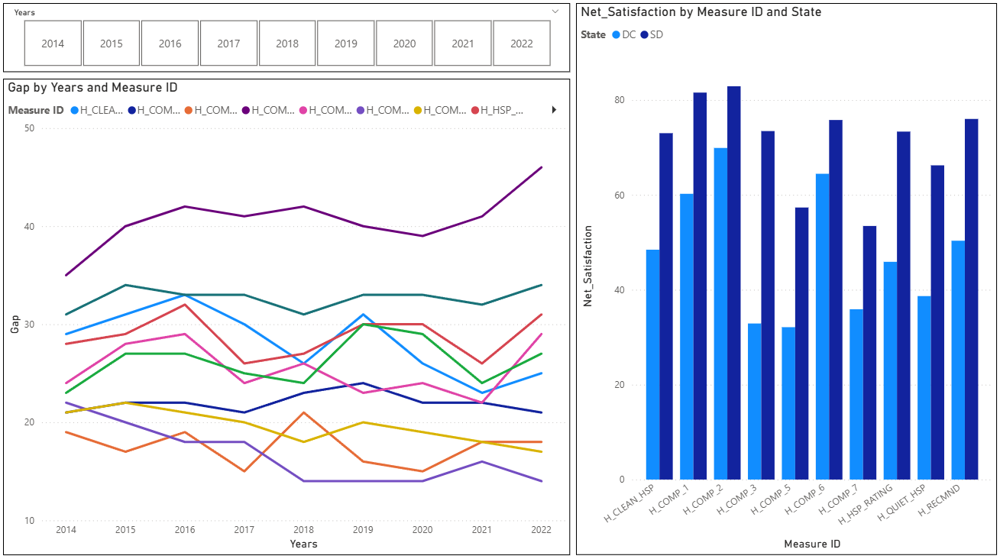

# 🏥 Phân tích Trải nghiệm Bệnh nhân tại Mỹ qua dữ liệu HCAHPS (2014 - 2022)

## 📝 Giới thiệu dự án
Dự án này thực hiện phân tích chuyên sâu về sự khác biệt trong trải nghiệm của bệnh nhân nội trú giữa các bang tại Hoa Kỳ. Dựa trên bộ dữ liệu **HCAHPS** (Hospital Consumer Assessment of Healthcare Providers and Systems), chúng tôi tìm kiếm các xu hướng, sự phân hóa vùng miền và các điểm nghẽn trong chất lượng dịch vụ y tế. Chi tiết báo cáo xem file `HealthCareReport.docx`

---

## 📊 1. Tổng quan về HCAHPS
HCAHPS là thước đo vàng quốc gia nhằm đánh giá khách quan chất lượng chăm sóc dưới góc độ của người bệnh.

### 🔍 Các chỉ số khảo sát chính (IDs):

  
| ID | Khía cạnh trải nghiệm |
| :--- | :--- |
| **H_COMP_1** | Giao tiếp với y tá |
| **H_COMP_2** | Giao tiếp với bác sĩ |
| **H_COMP_3** | Phản hồi của nhân viên bệnh viện |
| **H_COMP_5** | Giao tiếp về thuốc |
| **H_COMP_6** | Thông tin xuất viện |
| **H_COMP_7** | Chuyển giao chăm sóc |
| **H_CLEAN_HSP** | Vệ sinh môi trường |
| **H_QUIET_HSP** | Độ yên tĩnh |
| **H_HSP_RATING** | Đánh giá tổng quan |
| **H_RECMND** | Khả năng giới thiệu bệnh viện |

> **Lưu ý về thời gian:** Dữ liệu công bố (Release Period) thường trễ hơn 1 năm so với thời điểm khảo sát thực tế. Dự án đã chuẩn hóa lại cột thời gian theo `End Date` của khảo sát để đảm bảo tính chính xác khi phân tích xu hướng.

---

## 🛠 2. Quy trình xử lý dữ liệu (ETL)
* **Xử lý định lượng:** Chuyển đổi các cột "Completed Surveys" từ dạng text (ví dụ: *FEWER THAN 50*) sang số (25) để thực hiện các phép tính trung bình.
* **Net Satisfaction:** Tính toán chỉ số trải nghiệm thuần theo công thức:  
    `Net Satisfaction = Tỷ lệ Tích cực (%) - Tỷ lệ Tiêu cực (%)`
* **Chuẩn hóa năm:** Tạo cột `Years` định dạng Decimal từ ngày kết thúc khảo sát để đồng bộ hóa các biểu đồ xu hướng.

---

## 📈 3. Kết quả phân tích chính

### 🌐 Cấp quốc gia
* **Sự ổn định:** Tỷ lệ đánh giá tích cực trung bình đạt **71.41%**, duy trì ổn định qua 9 năm nhưng không có sự cải thiện đột phá.
* **Điểm yếu hệ thống:** Các chỉ số về **Giao tiếp thuốc (H_COMP_5)** và **Tiếng ồn (H_QUIET_HSP)** luôn nằm ở nhóm thấp nhất.

### 📍 Phân hóa theo Bang
* **Nhóm dẫn đầu:** South Dakota (SD), Nebraska (NE), Wisconsin (WI). Tập trung ở khu vực nông thôn, mật độ dân số thấp giúp giảm áp lực y tế.
* **Nhóm báo động:** District of Columbia (DC) là khu vực có trải nghiệm tệ nhất. Các bang New York (NY), New Jersey (NJ) cũng có chỉ số thấp do áp lực đô thị hóa và quá tải hệ thống.

### 🥊 So sánh điển hình: Nebraska (NE) vs. District of Columbia (DC)
* Sự khác biệt lớn nhất nằm ở **khả năng phản hồi của nhân viên**.
* Khoảng cách về chất lượng dịch vụ giữa hai khu vực này lên tới hơn 20 điểm trải nghiệm.

---

## 💡 4. Đề xuất & Giải pháp

### 🚩 Cải thiện quy mô bang (Dành cho các bang nhóm dưới):
1.  **Giao tiếp về thuốc:** Áp dụng kỹ thuật "Phản hồi ngược" (Teach-back). Yêu cầu bệnh nhân giải thích lại cách dùng thuốc thay vì chỉ hỏi "Đã hiểu chưa?".
2.  **Quản lý tiếng ồn:** Thiết lập các "Giờ yên tĩnh" (Quiet Hours) và phối hợp với chính quyền địa phương để giảm tiếng ồn ngoại khu bệnh viện.
3.  **Chuyển giao chăm sóc:** Tăng cường vai trò của bác sĩ điều trị trong việc giải thích tình trạng bệnh khi xuất viện thay vì chỉ thông qua điều dưỡng.

---

## 🛠 5. Công cụ sử dụng
* **Power BI Desktop:** Xử lý dữ liệu (Power Query) và Trực quan hóa.
* **DAX:** Tính toán các chỉ số Net Satisfaction và Moving Average.
* **Dataset:** HCAHPS Patient Survey Data (2014-2022).

---

## 📸 Dashboard Preview

---
*Dự án được thực hiện bởi Vũ Quang Vinh*
*Kết nối với tôi qua [Vũ Vinh](https://www.linkedin.com/in/vinh-v%C5%A9-086122354/?lipi=urn%3Ali%3Apage%3Ad_flagship3_profile_view_base_contact_details%3BK5iGBJuoTNa1GR2Q8hkJbw%3D%3D)*
